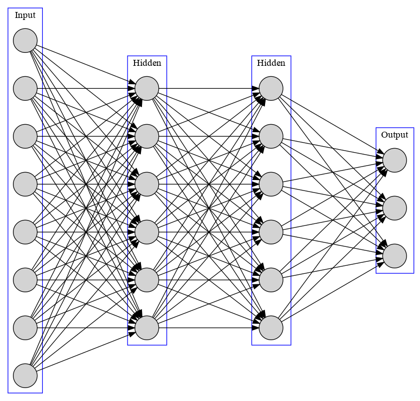

{width=200px}

Neural Network library

Copyright (c) 2019 Cole Design and Development, LLC

SPDX-License-Identifier: Apache-2.0

## Overview

This is a lightweight neural network library for use in microcontrollers and embedded systems. 

The code is divided into three sections:

1. `nn.[ch]` - this is the neural net library, which can be pulled into a project in whole, and should not require modification to use.

2. `train.c` - this is an example of how to use nn.c to construct, train, and save a neural network model.

3. `predict.c` - this code demonstrates how to use a saved neural network model to make predictions on new data.

## Features

With this library, neural networks of any width and depth may be constructed and trained. The following activation functions are supported:

* Identity
* Linear
* ReLU
* Leaky ReLU
* Threshold
* Sigmoid
* TanH

Different activation functions may be assigned to each layer in the network.

A bias can be added to each layer independently.

## Instructions

To build the nn library and sample training and prediction programs, just type:
```
make
```


To train:
```
./train
```
The included example data is the Semeion Handwritten Digit Data Set from the UCI Machine Learning Repository at:

http://archive.ics.uci.edu/ml/datasets/semeion+handwritten+digit


To use the trained model:
```
./predict
```

## Architecture

The network architecture is a fully connected feed-forward neural network. The widths of each layer, the activation function to be used, and the bias for each layer is set as each successive layer is added to the network using the `nn_add_layer()` function call. Multiple layers may be added to construct a deep neural network.

{width=400px}

